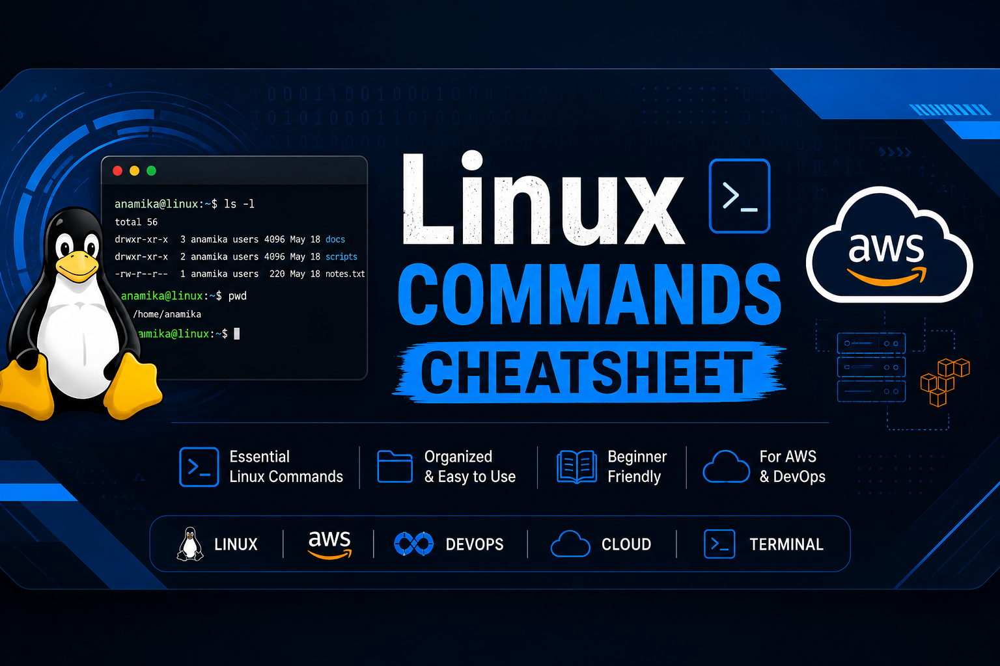

<p align="center">
  
</p>


<p align="center">
  
</p>


<p align="center">
  
</p>


# 🐧 Linux Commands Cheatsheet

> A beginner-friendly Linux commands reference designed for AWS Cloud and DevOps learners.

Learn essential Linux commands with practical examples, organized notes, and easy-to-understand explanations. This project is created to help students build a strong Linux foundation before moving to AWS Cloud, DevOps, and System Administration.

---


## 📑 Table of Contents

* [About the Project](#-about-the-project)
* [Features](#-features)
* [Project Structure](#-project-structure)
* [Linux Topics Covered](#-linux-topics-covered)
* [Installation](#-installation)
* [Usage](#-usage)
* [Screenshots](#-screenshots)
* [Future Improvements](#-future-improvements)
* [Contributing](#-contributing)
* [License](#-license)
* [Author](#-author)

---

## 📖 About the Project

The **Linux Commands Cheatsheet** is a structured learning resource created for students and beginners who want to build a strong foundation in Linux before moving to AWS Cloud, DevOps, and System Administration.

This repository contains categorized Linux commands with explanations, practical examples, and organized notes that make learning Linux simple and effective.

### 🎯 Project Goals

* Learn Linux from basic to intermediate level.
* Understand commonly used Linux commands.
* Build a strong base for AWS Cloud and DevOps.
* Practice commands with real-world examples.
* Create a quick reference guide for daily use.

---

## 🚀 Features

* 📚 Well-organized Linux command categories
* 💻 Beginner-friendly explanations
* ⚡ Practical command examples
* 📂 Easy-to-navigate project structure
* ☁️ Designed for AWS Cloud & DevOps learners
* 📝 Clean and professional documentation
* 🔍 Quick reference for daily Linux usage

---

## 📁 Project Structure

```text
linux-commands-cheatsheet/
│
├── README.md              # Project documentation
├── LICENSE                # MIT License
└── images/                # Screenshots and project assets
```

This structure keeps the repository clean, organized, and easy to navigate.

---

## 📚 Linux Topics Covered

This cheatsheet is organized into the following categories:

* 📂 Navigation Commands

  * `pwd`
  * `ls`
  * `cd`

* 📁 File Management

  * `mkdir`
  * `touch`
  * `cp`
  * `mv`
  * `rm`

* 📄 File Viewing

  * `cat`
  * `less`
  * `head`
  * `tail`

* 🔐 Users & Permissions

  * `useradd`
  * `passwd`
  * `chmod`
  * `chown`

* ⚙️ Process Management

  * `ps`
  * `top`
  * `kill`

* 🌐 Networking

  * `ping`
  * `ifconfig`
  * `ip`
  * `netstat`

* 💾 Disk Management

  * `df`
  * `du`
  * `mount`

* 📦 Package Management

  * `apt`
  * `yum`

* 🔍 Search & Utilities

  * `find`
  * `grep`
  * `history`

---

## ⚙️ Installation

Clone the repository using Git:

```bash
git clone https://github.com/anamika-saini/linux-commands-cheatsheet.git
```

Navigate to the project directory:

```bash
cd linux-commands-cheatsheet
```

Open the `README.md` file and start exploring Linux commands.

---

## 📖 Usage

This repository can be used as:

* 📚 A learning guide for Linux beginners
* ☁️ A preparation resource for AWS Cloud and DevOps
* 💻 A quick reference during Linux practice
* 🎓 A revision guide before interviews and certifications
* 📝 A daily cheatsheet for commonly used Linux commands

Browse the command categories and practice each command directly in your Linux terminal for the best learning experience.

---

## 📸 Screenshots

Screenshots will be added in future updates to demonstrate the project structure and command examples.

> 📌 Stay tuned for upcoming improvements!

---

## 🔮 Future Improvements

Planned enhancements for this project include:

* ✅ Add command output examples
* ✅ Add Linux interview questions
* ✅ Include shell scripting basics
* ✅ Add advanced Linux commands
* ✅ Improve project documentation
* ✅ Add visual diagrams and screenshots
* ✅ Organize commands into separate files

---

## 🤝 Contributing

Contributions, suggestions, and improvements are always welcome.

If you have ideas to improve this project, feel free to fork the repository, create a new branch, and submit a Pull Request.

If you find any issues, please open an Issue in the repository.

---

## 📄 License

This project is licensed under the MIT License.

See the `LICENSE` file for more information.

---

## 👩‍💻 Author

**Anamika Saini**

🎯 Aspiring Cloud Engineer

🔗 GitHub: https://github.com/anamika-saini

Currently learning Linux, Git, GitHub, AWS Cloud, and DevOps while building hands-on projects to strengthen practical skills.

---
